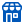
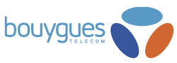
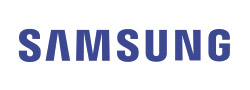
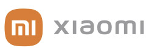
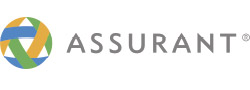
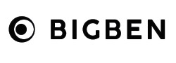
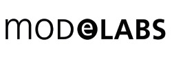

<picture>
  <source media="(prefers-color-scheme: dark)" srcset="./assets/logo/cinecom-logo-dark-theme.svg">
  <source media="(prefers-color-scheme: light)" srcset="./assets/logo/cinecom-logo-light-theme.svg">
  
</picture>

<a href="https://cinecom.fr/">
  <picture>
    <source media="(prefers-color-scheme: dark)" srcset="./assets/tagline/tagline-dark.svg">
    <source media="(prefers-color-scheme: light)" srcset="./assets/tagline/tagline-light.svg">
    
  </picture>
</a>

 

## 👋 À propos du groupe

**Cinécom** est un distributeur indépendant français, spécialiste de la **téléphonie mobile** et de **l'internet**, partenaire officiel de **Bouygues Telecom** depuis 1998. Née d'une première boutique à Chelles (Seine-et-Marne), l'entreprise s'est développée pour devenir un réseau national de boutiques de proximité.

Bienvenue sur l'organisation GitHub officielle du groupe Cinécom Holding, qui regroupe nos projets et outils internes.

## 🛍️ Nos activités

<table align="center">
<tr>
<td align="center" width="150">
<picture><source media="(prefers-color-scheme: dark)" srcset="./assets/icons/phone-dark.svg"><source media="(prefers-color-scheme: light)" srcset="./assets/icons/phone-light.svg"></picture>
 <b>Forfaits mobiles</b>
</td>
<td align="center" width="150">
<picture><source media="(prefers-color-scheme: dark)" srcset="./assets/icons/wifi-dark.svg"><source media="(prefers-color-scheme: light)" srcset="./assets/icons/wifi-light.svg"></picture>
 <b>Internet & Box</b>
</td>
<td align="center" width="150">
<picture><source media="(prefers-color-scheme: dark)" srcset="./assets/icons/headphones-dark.svg"><source media="(prefers-color-scheme: light)" srcset="./assets/icons/headphones-light.svg"></picture>
 <b>Accessoires</b>
</td>
<td align="center" width="150">
<picture><source media="(prefers-color-scheme: dark)" srcset="./assets/icons/shield-dark.svg"><source media="(prefers-color-scheme: light)" srcset="./assets/icons/shield-light.svg"></picture>
 <b>Assurance produits</b>
</td>
<td align="center" width="150">
<picture><source media="(prefers-color-scheme: dark)" srcset="./assets/icons/building-shop-dark.svg"><source media="(prefers-color-scheme: light)" srcset="./assets/icons/building-shop-light.svg"></picture>
 <b>Conseil en boutique</b>
</td>
</tr>
</table>

## 🤝 Partenaires

<table>
<tr>
<td align="center" width="130"></td>
<td align="center" width="130"></td>
<td align="center" width="130"></td>
<td align="center" width="130"></td>
</tr>
<tr>
<td align="center" width="130"></td>
<td align="center" width="130"></td>
<td align="center" width="130"></td>
<td align="center" width="130"></td>
</tr>
</table>

## 💡 Nos valeurs

<table>
<tr><td width="60" align="center"><picture><source media="(prefers-color-scheme: dark)" srcset="./assets/icons/target-dark.svg"><source media="(prefers-color-scheme: light)" srcset="./assets/icons/target-light.svg"></picture></td><td><b>Satisfaction client</b> — notre priorité au quotidien</td></tr>
<tr><td align="center"><picture><source media="(prefers-color-scheme: dark)" srcset="./assets/icons/book-dark.svg"><source media="(prefers-color-scheme: light)" srcset="./assets/icons/book-light.svg"></picture></td><td><b>Formation continue</b> de nos équipes, avec une pédagogie active</td></tr>
<tr><td align="center"><picture><source media="(prefers-color-scheme: dark)" srcset="./assets/icons/rocket-dark.svg"><source media="(prefers-color-scheme: light)" srcset="./assets/icons/rocket-light.svg"></picture></td><td><b>Innovation</b> et veille sur les évolutions technologiques</td></tr>
<tr><td align="center"><picture><source media="(prefers-color-scheme: dark)" srcset="./assets/icons/handshake-dark.svg"><source media="(prefers-color-scheme: light)" srcset="./assets/icons/handshake-light.svg"></picture></td><td><b>Partenariat durable</b>, avec Bouygues Telecom et nos boutiques</td></tr>
</table>

## 📍 Nous contacter

Une question sur nos offres, envie de rejoindre l'un de nos 27 points de vente ou de nous parler d'un projet ? Notre équipe est à votre écoute.

